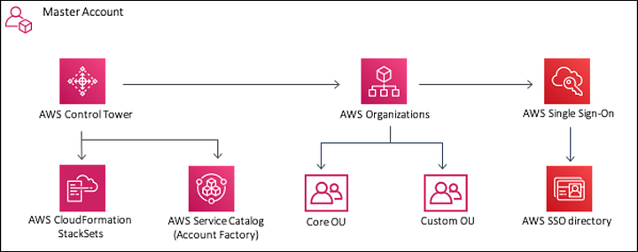
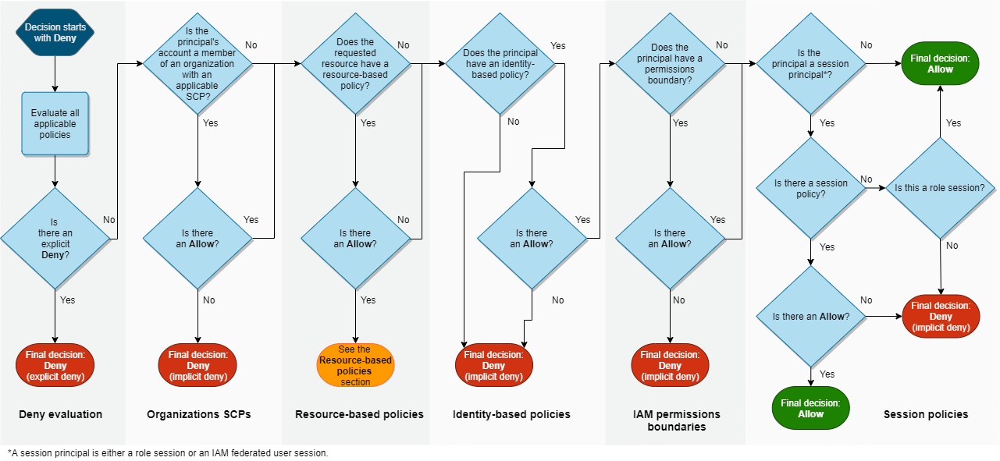

# Exam Readiness: AWS Certified Solutions Architect – Professional (Portuguese)

## Sessão 2: AWS Accounts and Organizations

> AWS Organizations é um serviço da Amazon Web Services (AWS) que permite que você organize e gerencie várias contas AWS em uma hierarquia. Com o AWS Organizations, você pode centralizar a cobrança e o pagamento das contas, aplicar políticas de controle de serviço (SCP) para controlar o acesso e as ações em contas e unidades organizacionais (OUs) específicas.

>  Service Control Policies (SCP): As SCPs são políticas que você pode associar a OUs ou contas individuais dentro da organização. Elas permitem que você defina restrições sobre quais serviços da AWS podem ser usados e quais ações podem ser executadas por essas contas ou OUs. Isso ajuda a manter o controle sobre o uso dos recursos da AWS e a garantir a conformidade com políticas de segurança e governança.

> Organizatinal Units (OUs): As OUs são contêineres lógicos que você cria para organizar suas contas. Por exemplo, você pode criar uma OU chamada "Produção" e outra chamada "Desenvolvimento" para agrupar contas relacionadas a esses ambientes.
 
> O AWS Control Tower é um serviço da Amazon Web Services (AWS) projetado para simplificar a implantação e a gestão de várias contas da AWS em uma organização. Ele foi projetado para ser usado em ambientes em que várias equipes ou departamentos têm suas próprias contas da AWS e precisam de um controle centralizado sobre essas contas.
(observação: aws control tower cria guardrails para garantir conformidade da conta)
>

## Sessão 3: Identity Management and Permissions

> Hieraquia de politicas de acesso:

> RBAC é um modelo baseado em papéis, onde as permissões são concedidas a papéis e os papéis são atribuídos a usuários. Isso permite que você gerencie as permissões dos usuários de forma centralizada, atribuindo-lhes os papéis que precisam para realizar seu trabalho.
> 
> **Exemplo**: RBAC Você pode usar RBAC para conceder permissões a usuários para acessar recursos específicos na AWS. Por exemplo, você pode criar um papel para administradores de banco de dados que concede permissões para criar, editar e excluir bancos de dados. Você pode então atribuir esse papel a usuários que precisam administrar bancos de dados.

> ABAC é um modelo baseado em atributos, onde as decisões de acesso são tomadas com base nos atributos dos usuários, recursos e solicitações. Isso permite que você implemente controles de acesso mais granulares e flexíveis.
> 
> **Exemplo**: ABAC: Você pode usar ABAC para implementar controles de acesso mais granulares e flexíveis. Por exemplo, você pode criar uma política que permita que usuários com o atributo "department" igual a "engenharia" acessem recursos específicos na AWS. Você também pode criar uma política que permita que usuários com o atributo "role" igual a "administrador" acessem todos os recursos na AWS.

| Característica	        | RBAC                 | 	ABAC
| --------------------------|----------------------|-------------------  
| Modelo	                | Baseado em papéis	   | Baseado em atributos
| Concessão de permissões	| Permissões são concedidas a papéis e papéis são | atribuídos a usuários	| Permissões são concedidas com base nos atributos | dos usuários, recursos e solicitações
| Granularidade	        | Menos granular	   | Mais granular
| Flexibilidade	        | Menos flexível	   | Mais flexível

> IAM, ou AWS Identity and Access Management, é um serviço da web que ajuda você a controlar o acesso aos recursos da AWS de forma segura. Com o IAM, você pode gerenciar, de maneira centralizada, permissões que controlam quais recursos da AWS os usuários poderão acessar.

> O AWS Security Token Service (STS) é um serviço da AWS que permite que você obtenha credenciais temporárias para acessar outros serviços da AWS. As credenciais temporárias são úteis para cenários em que você não deseja compartilhar suas credenciais de usuário raiz ou de usuário IAM de longo prazo com outros usuários ou aplicativos.

> Permissions Boundaries são uma ferramenta que permite controlar o máximo de permissões que uma entidade do IAM (usuário ou função) pode ter. Isso ajuda a evitar que usuários ou funções tenham acesso a recursos ou dados que não precisam.

> Exemplo: Você pode criar um limite de permissões para uma função de desenvolvedor que permite criar e gerenciar recursos de desenvolvimento, mas não permite fazer alterações em recursos de produção.

> IAM Policy Structure é a maneira como as políticas do IAM são definidas. Elas são compostas por um ou mais comandos, que definem as ações que um usuário ou função pode realizar em um recurso AWS.
