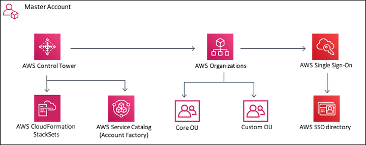

# Exam Readiness: AWS Certified Solutions Architect – Professional (Portuguese)

## Sessão 2: AWS Accounts and Organizations

> AWS Organizations é um serviço da Amazon Web Services (AWS) que permite que você organize e gerencie várias contas AWS em uma hierarquia. Com o AWS Organizations, você pode centralizar a cobrança e o pagamento das contas, aplicar políticas de controle de serviço (SCP) para controlar o acesso e as ações em contas e unidades organizacionais (OUs) específicas.

>  Service Control Policies (SCP): As SCPs são políticas que você pode associar a OUs ou contas individuais dentro da organização. Elas permitem que você defina restrições sobre quais serviços da AWS podem ser usados e quais ações podem ser executadas por essas contas ou OUs. Isso ajuda a manter o controle sobre o uso dos recursos da AWS e a garantir a conformidade com políticas de segurança e governança.

> Organizatinal Units (OUs): As OUs são contêineres lógicos que você cria para organizar suas contas. Por exemplo, você pode criar uma OU chamada "Produção" e outra chamada "Desenvolvimento" para agrupar contas relacionadas a esses ambientes.
 
> O AWS Control Tower é um serviço da Amazon Web Services (AWS) projetado para simplificar a implantação e a gestão de várias contas da AWS em uma organização. Ele foi projetado para ser usado em ambientes em que várias equipes ou departamentos têm suas próprias contas da AWS e precisam de um controle centralizado sobre essas contas.
(observação: aws control tower cria guardrails para garantir conformidade da conta)
>

